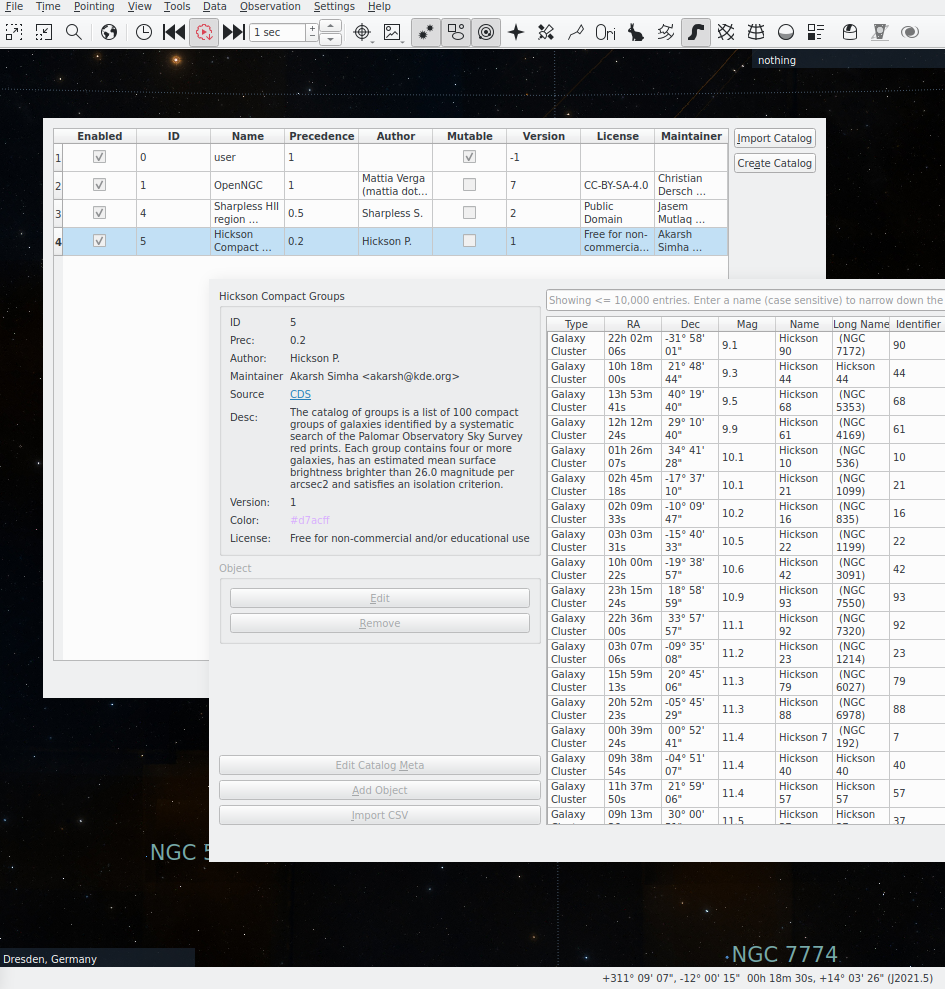

=====
Guide
=====

In this chapter we will detail the basic concepts, terminology and
ideas behind the catalog repo and apply them to the implementation of
an example catalog.

Basic Concepts / Terminology
============================

Deep Sky Object (DSO)
  Most astronomical objects outside the solar
  system. Some examples are Galaxies, Nebulas and Clusters.  Available
  object types can be found in :class:`.pykstars.ObjectType`.

Catalog
  A collection of DSOs with some metadata attached. See
  :class:`lib.catalogsdb.Catalog`.

  They are implemented as python modules that expose a class that
  subclasses :class:`lib.catalogfactory.Factory` to implement the
  build phases (see :ref:`phases`).

.. _phases:

Phases and How Catalogs are Built
=================================

The :ref:`cli` is the fronted to a set of very simple routines
contained in the ``builder.py`` file in the root of the repository. The
build process is subdivided into four phases.

1. The download phase during downloaded. This happens in parallel for
   all catalogs and the downloaded files are cached and re-downloaded
   upon changes to the catalog python files.

2. The loading phase during which the catalogs are being parsed and
   loaded into temporary databases. The results cached similar to the
   downloads and the loading is executed in parallel.

3. The deduplication phase in which each of the catalogs has read
   access to all other catalogs to search for and designate
   duplicates. These duplicate designations are then merged and the
   deduplication is performed.

4. The dump phase in which the catalogs are being written into
   individual files.

Each catalog implements functionality according to the three first
stages. Because the catalogs are basically python modules there is a
great amount of flexibility regarding how exactly this is done. We
encourage you to look at the catalog implementations in the
``catalogs`` directory in the catalog repo. The take home message here
is that it is only important to understand what data each phase
expects and not much more.

.. _dedupe:

Deduplication Mechanism
=======================

Each object in a catalog gets a (relatively stable) hash that is
calculated from some of its properties which is henceforth called the
``ID``.  When two objects (from different catalogs or otherwise) are
the same _physical_ object, then they will both be assigned the same
object id (``OID``) which is just the ``ID`` of the object in the
"oldest" catalog (with the lowest catalog id), trying to make it
stable under the introduction of new catalogs. Additionally each
catalog is assigned a priority value which is just a real number
(conventionally between zero and one). When loading objects from the
database into KStars and there are multiple objects with the same ``OID``
only the one from the catalog with the highest priority will be
loaded.

Implementing a Catalog (by Example)
===================================

.. note:: We assume you have cloned the catalog repo and set up the
  :ref:`cli`.

In this section we will implement the *Hickson Compact Groups*
catalog. As any catalogs has its own quirks it pays to look at the
implementation of other catalogs as reference. Also, don't forget that
there is the :ref:`api` documentation.

Boilerplate
-----------

To start, we create a new python file with a
descriptive name ``hickson_compact_groups.py`` in the ``catalogs`` directory.
This file (module) will contain the implementation of the new
catalog.

Now we import a few modules that we will need later.

.. code-block:: python
   :linenos:

   from lib.catalogfactory import Factory, Catalog
   from lib.utility import DownloadData, ByteReader
   from pykstars import ObjectType

   import pickle
   from astropy import units as u
   from . import open_ngc, ngcic_steinicke
   from astropy.time import Time
   from astropy.coordinates import SkyCoord
   from astropy.coordinates import FK5

The modules in lines one through three are required for most catalogs
and the rest will be required for implementation of this specific catalog.

Next we will create the scaffolding for our catalog.

.. code-block:: python
   :linenos:

   class Hickson(Factory):
       meta = Catalog(
           id=5,
           name="Hickson Compact Groups",
           author="Hickson P.",
           maintainer="Akarsh Simha <akarsh@kde.org>",
           description="""The catalog of groups is a list of 100 compact groups of galaxies
   identified by a systematic search of the Palomar Observatory Sky
   Survey red prints. Each group contains four or more galaxies, has an
   estimated mean surface brightness brighter than 26.0 magnitude per
   arcsec2 and satisfies an isolation criterion.""",
           source="<a href='https://cdsarc.unistra.fr/viz-bin/cat/VII/213'>CDS</a>",
           precedence=0.2,
           version=1,
           license="Free for non-commercial and/or educational use",
           colors={"default": "#d7acff",
                "night.colors": "#ff6164",
                "moonless-night.colors": "#ff6164"},
           image="hickson.jpg",
       )

       def __post_init__(self):
           pass

       def get_data(self):
           pass

       def load_objects(self):
           return []

       def get_dublicates(self, query_fn, catalogs):
           return []

The catalog is just a class that derives from
:class:`lib.catalogfactory.Factory` and overwrites the
:attr:`lib.catalogfactory.Factory.meta` class variable as well as some
of the methods, but let's focus on the metadata for now.

The ``meta`` class variable is of the type
:class:`lib.catalogsdb.Catalog` and its attributes are
documented. Nevertheless we'll look at some specifically.

``id``
  As the documentation says, this id should be chosen to be greater
  than all previous ids. The reason for this is that the deduplication
  algorithm assigns all duplicates the object identification of the
  object from the object from the catalog with the lowest id which is
  the oldest.

``name``
  The name of the catalog. This is what users of KStars will identify
  the catalog by.

``precedence``
  This property only matters if you want to deduplicate against
  another catalog. I is conventionally a number between zero and one
  and you may choose it to be one if in doubt.

``version``
  An integer that records the version of the catalog. It is usually
  initialized at one and then incremented when a major change is made
  to the catalog.

``image``
  Path to a thumbnail image for the catalog. The path is relative to
  the directory ``data/[name_of_module]``.

The other fields are somewhat optional but should be filled for a good
catalog.

If you now execute ``kscat list-catalogs`` the catalog won't
appear. That's because we have to add it as a module.
To do that, we add

.. code-block:: python

   from .hickson_compact_groups import Hickson

to ``catalogs/__init__.py`` to register the catalog.

Now it shows up in the cli tool.

.. code-block:: console

   $ kscat list-catalogs
    id                             name  precedence
     1                          OpenNGC         1.0
     2               NGC IC (Steinicke)         0.1
     3          Abell Planetary Nebulae         0.3
     4     Sharpless HII region Catalog         0.5
     5           Hickson Compact Groups         0.2
     6 Lynds' Catalogue of Dark Nebulae         1.0

Very nice! We can even try to build it

.. code-block:: console

   $ kscat build -c 5
   INFO:builder:Getting data for the catalog 'Hickson Compact Groups'.
   INFO:builder:Registering the catalog 'Hickson Compact Groups' in a temporary db and parsing.
   INFO:builder:Loading the catalog 'Hickson Compact Groups'.
   INFO:builder:Deduplicating.
   INFO:builder:Dumping the catalogs.
   INFO:builder:Dumping contents of the catalog 'Hickson Compact Groups' into '/home/hiro/Documents/Projects/kstars_catalogs/out/5_HicksonCompactGroups_1.kscat'.

and it works. It doesn't do much however and just creates an empty
catalog. Let us change that by implementing data acquisition for the
first build stage.

Obtaining the Catalog Data
--------------------------

We begin by implementing :meth:`lib.catalogfactory.Factory.__post_init__` which is
the same as ``__init__`` but does not interfere with the
initialization inherited from :class:`lib.catalogfactory.Factory`:

.. code-block:: python
   :linenos:

   def __post_init__(self):
       self.hick = DownloadData(
           url="https://cdsarc.unistra.fr/ftp/VII/213/groups.dat",
       )

We created a download resource (see also
:class:`lib.utility.DownloadData`) and stored it in
``self.hick``. Now we can go ahead and actually download it by
implementing the :meth:`lib.catalogfactory.Factory.get_data` method:

.. code-block:: python
   :linenos:

   def get_data(self):
           self.download_cached(self.hick)

Indeed we can build the catalog again and observe the action:

.. code-block:: console

   $ kscat build -c 5
   INFO:builder:Getting data for the catalog 'Hickson Compact Groups'.
   INFO:lib.utility:Downloading: https://cdsarc.unistra.fr/ftp/VII/213/groups.dat
   INFO:builder:Registering the catalog 'Hickson Compact Groups' in a temporary db and parsing.
   INFO:builder:Loading the catalog 'Hickson Compact Groups'.
   INFO:builder:Deduplicating.
   INFO:builder:Dumping the catalogs.
   INFO:builder:Dumping contents of the catalog 'Hickson Compact Groups' into '/home/hiro/Documents/Projects/kstars_catalogs/out/5_HicksonCompactGroups_1.kscat'.

   $ ls .cache/5_HicksonCompactGroups_1/Downloads/groups.dat
   .cache/5_HicksonCompactGroups_1/Downloads/groups.dat

.. note:: If, at any point, you think that the cache is not being
          updated, you can clean it with ``kscat clean --cache-only``.

If the datasource is not very reliably and the amount of data is small
then you can include it direclty into the catalog repo by creating a
folder ``data/[name_of_module]`` and putting the source data there. It
can subsequently be accessed by
:meth:`lib.catalogfactory.Factory._in_data_dir`. See the Abell Catalog
for an example.

Parsing the Catalog
-------------------

Of course the catalog that is being created is still empty. Let's
do something about it by implementing :meth:`lib.catalogfactory.Factory.load_objects` corresponding
to phase 2.

.. code-block:: python
   :linenos:

   def load_objects(self):
       with self.hick.open("rb") as cat:
           frame = FK5(equinox=Time(1950, format="jyear"))
           fk5_2000 = FK5(equinox=Time(2000, format="jyear"))

           for line in cat.readlines():
               reader = ByteReader(line)
               cat_nr = reader.get(1, 3)
               coords = SkyCoord(
                   ra=(
                       reader.get(5, 6, int)
                       + reader.get(7, 8, int) * 1 / 60
                       + reader.get(9, 10, int) * 1 / (60 ** 2)
                   )
                   * u.hourangle,
                   dec=(
                       (-1 if reader.get(11, 11) == "-" else 1)
                       * (
                           reader.get(12, 13, int) * u.degree
                           + reader.get(14, 15, int) * u.arcmin
                           + reader.get(16, 17, int) * u.arcsec
                       )
                   ),
                   frame=frame,
               )

               coords = coords.transform_to(fk5_2000)
               radius = reader.get(24, 28, float) / 2
               mag = reader.get(29, 33, float)

               names = [
                   name[1:]
                   for beg, end in [(46, 51), (53, 58), (60, 65), (67, 72)]
                   if len(name := reader.get(beg, end)) > 0 and name.startswith("N")
               ]

               name = f"Hickson {cat_nr}"
               yield self._make_catalog_object(
                   type=ObjectType.GALAXY_CLUSTER,
                   ra=coords.ra.degree,
                   dec=coords.dec.degree,
                   magnitude=mag,
                   name=name,
                   long_name=name + (f" (NGC {names[0]})" if names else ""),
                   major_axis=radius / 2,
                   minor_axis=radius / 2,
                   catalog_identifier=cat_nr,
               )

This method is generally implemented as a generator that parses the
catalog data and yields :class:`lib.catalogsdb.CatalogObject`. Some
parts of the implementation are mostly universal, like opening the
input file and constructing ``CatalogObjects`` but the majority of
code in this example deals with the concrete format of this
catalog. Let's go over it in detail.

In the second line we begin by opening the previously downloaded file
in binary read mode. See also :meth:`lib.utility.DownloadData.open`.

.. code-block:: python

   with self.hick.open("rb") as cat:

This has to do with the format the hickson catalog in which every line
is a byte string of data and certain byte ranges are associated with
certain data fields like name and coordinates.

The next two lines set up two different coordinate frames. The first
corresponds to the one of the catalog and the second one to the frame
expected by KStars. For information on frames see `Wikipedia
<https://en.wikipedia.org/wiki/Earth-centered_inertial#J2000>`_ and on
transformations between these frames see `the astropy docs
<https://docs.astropy.org/en/stable/coordinates/transforming.html>`_.

.. code:: python

   frame = FK5(equinox=Time(1950, format="jyear"))
   fk5_2000 = FK5(equinox=Time(2000, format="jyear"))

Lines 6 through 37 are concerned with the details of parsing the
individual rows of data and we won't go into detail here, because this
is not generalizable to other catalogs. It shall be noted though, that
it is a good idea to use :class:`astropy.coordinates.SkyCoord` to
handle coordinate parsing and conversion. Also :mod:`astropy.units`
may come in handy.

Having parsed all the data we need, we can now turn to putting it into
a format that KStars will understand. For that we use
:meth:`lib.catalogfactory.Factory._make_catalog_object`.

.. code:: python

   yield self._make_catalog_object(
       type=ObjectType.GALAXY_CLUSTER,
       ra=coords.ra.degree,
       dec=coords.dec.degree,
       magnitude=mag,
       name=name,
       long_name=(f" (NGC {names[0]})" if names else ""),
       major_axis=radius / 2,
       minor_axis=radius / 2,
       catalog_identifier=cat_nr,
   )

We refer to the :ref:`api` documentation for the meaning of the fields
here, but will note that coordinates are expected in degrees and the
major and minor axes in arc-minutes. Also the role of
`catalog_identifier` field is a bit vague. It should generally be a
sensible unique identifier of the object in the context of the catalog
to be used in deduplication. We have chosen the long name to include
the NGC designation but it can include any number of other names that
are present in the catalog. But before we cross that bridge we will
compile the catalog to test if everything worked out as it should.

.. code-block:: console

   $ kscat build -c 5
   INFO:builder:Getting data for the catalog 'Hickson Compact Groups'.
   INFO:lib.utility:Downloading: https://cdsarc.unistra.fr/ftp/VII/213/groups.dat
   INFO:builder:Registering the catalog 'Hickson Compact Groups' in a temporary db and parsing.
   INFO:builder:Loading the catalog 'Hickson Compact Groups'.
   INFO:builder:Deduplicating.
   INFO:builder:Dumping the catalogs.
   INFO:builder:Dumping contents of the catalog 'Hickson Compact Groups' into '/home/hiro/Documents/Projects/kstars_catalogs/out/5_HicksonCompactGroups_1.kscat'.

   $ ls out/5_HicksonCompactGroups_1.kscat
   out/5_HicksonCompactGroups_1.kscat

Indeed you can use an sqlite database browser or KStars itself to
verify the contents the catalog.

Deduplication
-------------

We've already mentioned that some of the objects in this catalog
appear in ``OpenNGC`` catalog as well. We mark those as duplicates by
implementing the :meth:`lib.catalogfactory.Factory.get_dublicates` method.
The basic idea is, that we search the catalog database (which now
contains all built catalogs) for duplicates of an objects in the
current catalog and ``yield`` a set of tuples of the form ``([catalog
id], [object hash])``. The deduplication is transitive, meaning that
if we mark an object as duplicate of another object in the ``OpenNGC``
catalog and that object in turn is marked as a duplicate of another
object in another catalog in the ``OpenNGC`` catalog code, we do not
need to repeat this in the implementation of the current catalog.

The one piece of data about each object we need for the deduplication
is its NGC number. Unfortunately there is no good way to store this
data in the objects themselves. We could try to get it back from the
``long_name`` property, but that would be messy. The second idea is to
store a map between the catalog number of the objects and its NGC
number, if any, in an instance variable. This is problematic, because
the ``load_objects`` method may be skipped due to caching. The
solution is to use the :attr:`lib.catalogfactory.Factory._state`
instance variable which is being persisted to disk.

Therefore we add the following to ``__post__init__``

.. code:: python

   self._state = dict(names=dict())

and insert

.. code:: python

   if names:
       self._state["names"][cat_nr] = names[0]

into ``load_objects`` before ``name = f"Hickson {cat_nr}"``.

This creates a dict that associates the NGC number with the Hickson
catalog number.

Next, we implement :meth:`lib.catalogfactory.Factory.get_dublicates` method.

.. code-block:: python
   :linenos:

   def get_dublicates(self, query_fn, catalogs):
       open_ngc_id = open_ngc.OpenNGC.meta.id

       if open_ngc_id not in catalogs:
           return []

       for obj in query_fn(self.meta.id):
           if obj.catalog_identifier not in self._state["names"]:
               continue

           name = self._state["names"][obj.catalog_identifier]
           ngc_designation = "NGC" + name.zfill(4)

           suspects = query_fn(
               open_ngc_id,
               f"catalog_identifier LIKE '{ngc_designation}' AND trixel = {obj.trixel}",
           )

           for suspect in suspects:
               yield {(self.meta.id, obj.hash), (open_ngc_id, suspect.hash)}

This method receives a query function which provides access to the
database and a list of the IDs of the enabled catalogs.

As we want to dedublicate agains the openngc catalog, we first check
if OpenNGC has been enabled for this build.

.. code:: python

   open_ngc_id = open_ngc.OpenNGC.meta.id

   if open_ngc_id not in catalogs:
       return []

This is not strictly necessary but saves time when we build the
catalog without enabling OpenNGC. For small catalogs like this
however, it is not worth the effort to perform this check. We've
included it here to demonstrate the pattern.

After this check, we retrieve all objects from the current catalog
with ``query_fn(self.meta.id)`` and loop through them. In the loop we
check if the object has an NGC number (lines 8,9) and then construct
the catalog identifier of the NGC object in lines 11 and 12.

Finally we retrieve all dublicate objects from openngc by querying the
database:

.. code:: python

   suspects = query_fn(
       open_ngc_id,
       f"catalog_identifier LIKE '{ngc_designation}' AND trixel = {obj.trixel}",
   )

Please read the api documentation for the exact syntax of the query
function. In a nutshell, the first argument is the id of the catalog
we wish to search [#]_ and the second one is a SQL ``WHERE`` clause. In
this instance we look for objects with a specific
``catalog_identifier``. This would be enough in this instance, but for
bigger catalogs it is always wise to only search objects in a similar
part of the sky. This is what ``trixel = {obj.trixel}`` does.

Having retreived the dublicates, all that remains is to ``yield`` them
in the expected format:

.. code:: python

   for suspect in suspects:
       yield {(self.meta.id, obj.hash), (open_ngc_id, suspect.hash)}

To test our work, we can run the CLI tool and inspect the results as
in the last section. Inserting a debug print statement in the above
code is also a good method to test dedublication.

.. code-block:: console

   $ kscat build -c 5 -c 1
   INFO:builder:Getting data for the catalog 'OpenNGC'.
   INFO:builder:Getting data for the catalog 'Hickson Compact Groups'.
   INFO:lib.utility:Downloading: https://cdsarc.unistra.fr/ftp/VII/213/groups.dat
   INFO:builder:Registering the catalog 'Hickson Compact Groups' in a temporary db and parsing.
   INFO:builder:Using 'OpenNGC' from cache.
   INFO:builder:Loading the catalog 'OpenNGC'.
   INFO:builder:Loading the catalog 'Hickson Compact Groups'.
   INFO:builder:Deduplicating.
   INFO:builder:Dumping the catalogs.
   INFO:builder:Dumping contents of the catalog 'OpenNGC' into '/home/hiro/Documents/Projects/kstars_catalogs/out/1_OpenNGC_7.kscat'.
   INFO:builder:Dumping contents of the catalog 'Hickson Compact
   Groups' into
   '/home/hiro/Documents/Projects/kstars_catalogs/out/5_HicksonCompactGroups_1.kscat'.

Note that we also have to enable the OpenNGC catalog with ``-c
5``. Alternatively you can omit the ``-c`` arguments altogether to
build the whole catalog suite.

Summary and Outlook
-------------------

In the above, we implemented the parsing and deduplication of the
"Hickson Compact Groups Catalog". While this has shown us the most
common challenges and solutions, it has to be noted that every catalog
is unique and has to be treated differently. That is the reason for
using python modules as the catalog specification. While we have
covered many utilities here, there is a lot more functionality which
you may find useful when implementing a catalog. For example, the
Abell catalog comes from a source that is not expected to be around
"forever" (a personal website). Therefore a copy is stored in the
catalog repo and accessed through
:meth:`lib.catalogfactory.Factory._in_data_dir`. This is just one
example why it is wise to study the :ref:`api` documentation. When in
doubt, you can always open an issue or a merge request and request
help.

.. [#] To search all catalogs, use
       :attr:`lib.catalogsdb.CATALOGS.all_objects` first argument.
